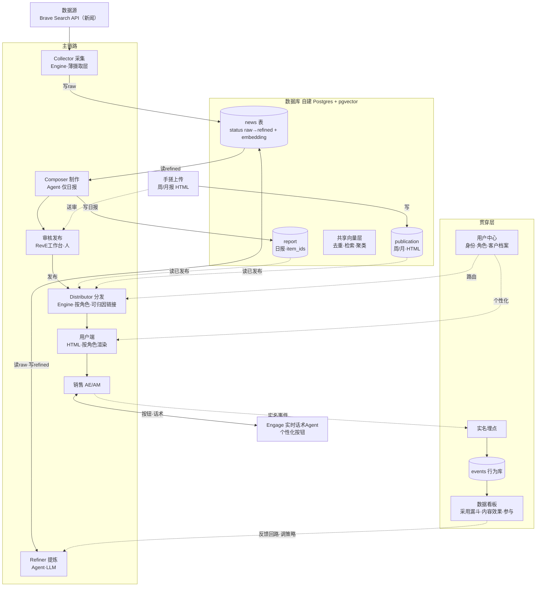

# Airwallex 销售情报平台 · Demo

> 作业：站在 Airwallex 角度，设计并实现一个「市场信息 / 新闻收集与分析」工具，稳定产出日报 / 周报 / 月报，信噪比要高。
> 本仓库 = 方案 + 真实运行的端到端系统（已部署上线、用真实新闻跑出，非示意数据）。

## 🌐 在线体验（建议直接看这个）

- **首页**：http://13.214.205.219/airwallex/
- **解题思路 + 完成度**：http://13.214.205.219/airwallex/solution.html
- **用户端（销售视角）**：http://13.214.205.219/airwallex/app.html　——　用 **Alex（AE）/ Cindy（AM）** 两个身份分别进，对比看到的不同
- **RevE 工作台（管理端）**：http://13.214.205.219/airwallex/admin.html　——　看「日报审核」：AI 每天出 3 个候选，人选 1 版发布

> 本地起：`cd web && python3 -m http.server 8000`（客户匹配 / 话术 / 反馈 / 审核等接口需后端，完整体验请用上面的在线地址）。

## 一句话

**这道题表面是"收集新闻"，本质是一道销售赋能题：把海量、低价值的市场信息，转化为一线销售能直接使用的成交能力。** 同样一句"做新闻工具"，可以交出一个没人用的聚合器，也可以交出一个改变销售产出的系统——差别不在技术，而在于先回答了"为谁、解决什么"。

## 完成度（都已上线、真实数据）

- **日报**：Brave 真实新闻 → LLM 逐条打标/评分/概览 → 每天编排 3 个候选 → 人选 1 版发布（落库可追溯）；按 AE/AM 差异化、6 中 + 2 英、每条带「概览 + 动作」+ 客户匹配 + 实时话术 + 有用/没用反馈闭环。
- **周报**：人工成品上传 → 审核 → 发布；一期真实周报在线。
- **月报**：一期真实特刊（真实数据 + 视频 + AI 播客）在线。
- **RevE 工作台**：策略 / 日报审核 / 周报审核 / 月报审核 / 情报库 / 数据统计（真实反馈）/ 用户。
- **技术栈**：Brave + OpenRouter(LLM) + Supabase(Postgres) + Flask + nginx + EC2，全开源可自托管。
- **可扩展到飞书 / Slack（架构已支持，待接入）**：分发层本就是「按角色路由」的可插拔结构，接入对应机器人 API 即可把日报/周报直推到群或个人，核心无需改动；当前仅因无 API 凭证未接。
- 刻意不做：真实 CRM 对接（用模拟名单）、语义去重 pgvector、本地化、秒级实时。详见 solution 页「07 完成度」。

## 解题思路（精简）

1. **问题界定**：岗位是 Revenue Enablement，所以把题目重定义为"为一线销售，把市场信息转化为成交能力"。信噪比从此是必须守住的**约束**，而非核心。
2. **用户**：运营主体是 RevE → 用户必然是它服务的人：**AE（拓新 / Hunter）+ AM（客户成功 / Farmer）**。两类角色情报需求不同。
3. **决定性论据**：几乎每份销售 JD 都写着"跟进行业趋势、做行业动态代言人"——市场情报是 Airwallex 自己写进考核的硬职责，却没有工具支撑。本平台填的正是这个缺口。
4. **三种产品**：不是同一内容的三种长度，而是沿"周期越长、自动化越低、人的判断越重"展开——日报全自动 / 周报半自动 / 月报人主导。信噪比分解进每种：日报靠过滤、周报靠选择、月报靠判断。
5. **如何触达（Reach · Teach · Engage）**：让情报按角色到达（日报）→ 炼成可复用话术与培训（周报）→ 让销售主动参与、行为可追踪（按钮、自测、反馈回路）。

## 架构



技术栈全部开源、可自托管（Postgres+pgvector / Git / Nginx / Python），可跑在一台 EC2 上；唯一外部付费项是 LLM API。

## Demo 范围与取舍

敢于取舍本身是方案的一部分。本次聚焦：**日报**为核心（真实新闻 + 信噪比过滤 + 按角色差异化 + 客户匹配与话术生成 + 有用/没用反馈闭环）+ **周报 / 月报**样例 + **RevE 工作台**。明确不做：与真实 CRM / 内部系统对接（demo 用模拟客户名单演示匹配）、全自动替代人写话术、面向其他区域的本地化版本、秒级实时——不在"用最小的东西证明方案成立"的关键路径上。

## 已知局限

- 参与数据（打开率 / 点击 / 答题）与销售真实业绩、KPI 的因果关系尚无法证明，当前仅作参考。
- 采集对微信 / 小红书生态内的、以及付费源的新闻覆盖有限。
- 月报「人主导」意味着含人工编辑成分，本次 demo 暂未制作。
- 真实样例直接进系统看：日报 http://13.214.205.219/airwallex/app.html ；RevE 工作台 http://13.214.205.219/airwallex/admin.html

## 目录

```
web/        前端四页 + 设计系统
docs/       产品方案、周报上传接口、周报模块开发文档
engine/     后端引擎（采集 / 提炼 / 编排 / API）
```
